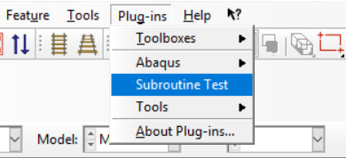

# SubroutineTest

SubroutineTest is Abaqus 6.14 plugin intended for user-defined constitutive model assessment automation. As such, its planned purpose is to allow to pre-configure and autogenerate simple dynamic/explicit models for user-defined UHARD/VUHARD subroutines.

## Formalities

The plugin is part of my Master's Thesis "Assessment of material models describing behaviour of metals under high strain rate deformation conditions". As such, no third-party contributions to this project may be accepted until the day of my thesis' defence. However, feel free to fork and/or use the plugin, as long as you find it worth using.

## Setup

To install SubroutineTest plugin, copy entire project tree to *<Abaqus installation directory>/SIMULIA/6.14-3/code/python2.7/lib/abaqus_plugins*. 
Then, enter *SubroutineTest* folder and run *setup.py* script to compile project sources. To be able to use the plugin, you need to restart Abaqus CAE if one is running.

## Usage

After successful setup *SubroutineTest* plugin should be accessible from Plug-ins tab as shown below:

